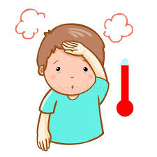
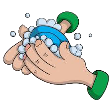
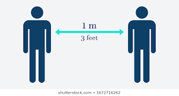
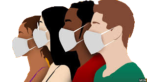

<!-- saved from url=(0035)http://localhost/coronago/index.php -->
<html><head><meta http-equiv="Content-Type" content="text/html; charset=UTF-8">
<title></title>

  <meta name="viewport" content="width=device-width, initial-scale=1">
  <link rel="stylesheet" href="./index.php_files/bootstrap.min.css">
  <link href="./index.php_files/css" rel="stylesheet">
  <link rel="stylesheet" href="./index.php_files/font-awesome.min.css" integrity="sha256-eZrrJcwDc/3uDhsdt61sL2oOBY362qM3lon1gyExkL0=" crossorigin="anonymous">
  
 
 
<!-- Popper JS -->
  
  </head>

<body>
<nav class="navbar navbar-expand-lg nav_style p-3">
  <a class="navbar-brand pl-5" href="http://localhost/coronago/index.php#">COVID-19</a>
  <button class="navbar-toggler" type="button" data-toggle="collapse" data-target="#navbarSupportedContent" aria-controls="navbarSupportedContent" aria-expanded="false" aria-label="Toggle navigation">
    
  </button>

  

    <ul class="navbar-nav ml-auto pr-5 text-capitalize">
      <li class="nav-item active">
        <a class="nav-link" href="http://localhost/coronago/index.php#">Home (current)</a>
      </li>
      <li class="nav-item active">
        <a class="nav-link" href="http://localhost/coronago/index.php#aboutid">about  </a>
      </li>
      <li class="nav-item active">
        <a class="nav-link" href="http://localhost/coronago/index.php#sympid">symptoms </a>
      </li>
      <li class="nav-item active">
        <a class="nav-link" href="http://localhost/coronago/index.php#preventid">prevention </a>
      </li>
	   <li class="nav-item active">
        <a class="nav-link" href="http://localhost/coronago/index.php#contactid">contact</a>
      </li>
    </ul>
   
  

</nav>
 

	

		

			

				

        

            

<h1> Let's stay safe &amp; fight together  against corna virus</h1>

<!--/////////////////// corona latest update///////////////-->
<section class="corona_update">

<h3 class="text-uppercase text-center pb-3">covid-19 updates</h3>

<h1 class="count">1,524,266</h1>

Passengers screened at airport

<h1 class="count">512</h1>

Active COVID-19 cases*

<h1 class="count">40</h1>

Cursed/discharged cases

<h1 class="count">9</h1>

Death cases

<!--/////////////////////about section////////////////////-->

<h1>About COVID-19</h1>

<h2> What is COVID-19(corona-virus)</h2>
 
COVID-19 is a disease caused by the “novel corona virus”. Common symptoms are: Fever, Dry cough, Breathing difficulty
Some patients also have aches and pains, nasal congestion, runny nose, sore throat or diarrhoea About 80% of confirmed cases recover from the disease
without any serious complications. However, one out of every six people who gets COVID-19 can become seriously ill* and develop difficulty in breathing. In more
severe cases, infection can cause severe pneumonia and other complications which can be treated only at higher level facilities (District Hospitals and above). In a
few cases it may even cause death.

<h2> How does COVID-19 spread</h2>

COVID-19 spreads mainly by droplets produced
as a result of coughing or sneezing of a COVID-19
infected person. This can happen in two ways: 1. Direct close contact: one can get the infection by being in close contact with COVID-19
patients (within one Metre of the infected person), especially if they do not cover their face when coughing or sneezing. 
2.Indirect contact: the droplets survive on surfaces and clothes for many days. Therefore,touching any such infected surface or cloth
and then touching one’s mouth, nose or eyes can transmit the disease. The incubation period of COVID 19 (time between
getting the infection and showing symptoms) is 1 to 14 days Some people with the infection, but without any
serious symptoms can also spread the disease.
 

<!--////////////////////corona symptoms/////////////-->

<h1>Coronavirus Symptoms</h1>

	

		

			<figure class="text-center">
			
			<figcaption>PERSISTENT  COUGH</figcaption>
			</figure>
			

		

			<figure class="text-center">
			
			<figcaption>FEVER</figcaption>
			</figure>
			
	
		

			<figure class="text-center">
			
			<figcaption>DIFFICULTY  BREATHING</figcaption>
			</figure>
			
	
		

			<figure class="text-center">
			
			<figcaption>RUNNY NOSE</figcaption>
			</figure>
			
	
		

			<figure class="text-center">
			
			<figcaption>SORE THROAT</figcaption>
			</figure>
			

        

			<figure class="text-center">
			
			<figcaption>TIREDNESS</figcaption>
			</figure>
			
			
	

  

<!--////////////////////prevention against corona/////////////-->

<h1>6 Steps To Prevent COVID-19</h1>

	

		

			

				

				<figure class="text-center">
				
			</figure>
			

			

			
Wash with soap and water for at least 20 seconds. You can also use hand sanitizer that contains 
			at least 60% alcohol.

		

		

			

				

				<figure class="text-center">
				
			</figure>
			

			

			
Put distance between yourself and others Put distance between yourself and other people if COVID-19 is spreading in your community.
                 Avoid close contact with people who are sick.

		

		

			

				

				<figure class="text-center">
				
			</figure>
			

			

			
Stay home if you’re sick Don’t leave home except to get medical care.

		

		

			

				

				<figure class="text-center">
				
			</figure>
			

			

			
Cover coughs and sneezes Cover with a tissue or the inside of your elbow. Throw tissues in the trash and clean your hands.

		

		

			

				

				<figure class="text-center">
				
			</figure>
			

			

			
Only wear a face mask if you’re sick or caring for someone who is You should wear a face mask when you are around other people and before you enter a healthcare provider’s office. If you are not sick, 
 you do not need to wear a face mask unless you are caring for someone who is sick.

		

		

			

				

				<figure class="text-center">
				
			</figure>
			

			

			
Clean and disinfect frequently touched surfaces These are things like countertops, doorknobs, light switches, phones and keyboards.

		

	

<!--////////////////////contact us form/////////////-->

<h1>Contact us</h1>

	

		

		<form action="http://localhost/coronago/index.php" method="POST">
		

    <label>Username</label>
    <input type="text" class="form-control" name="username" placeholder="name" autocomplete="off" required="">
  

  
  

    <label>Email </label>
    <input type="email" class="form-control" name="email" placeholder="name@example.com" required="" autocomplete="off">
  

  
	

    <label>Mobile</label>
    <input type="number" class="form-control" name="mobile" placeholder="mobile" autocomplete="off" required="">
  

  

    <label>Select Symptoms</label> 
  
  

  <input type="checkbox" class="custom-control-input" id="customcheckbox1" name="coronasym[]" value="cold">
  <label class="custom-control-label" for="customcheckbox1">Cold</label>
  

  
  

  <input type="checkbox" class="custom-control-input" id="customcheckbox2" name="coronasym[]" value="fever">
  <label class="custom-control-label" for="customcheckbox2">Fever</label>
  

  
  

  <input type="checkbox" class="custom-control-input" id="customcheckbox3" name="coronasym[]" value="breath">
  <label class="custom-control-label" for="customcheckbox3">Difficulty in breath</label>
  

  
  

  <input type="checkbox" class="custom-control-input" id="customcheckbox4" name="coronasym[]" value="tired">
  <label class="custom-control-label" for="customcheckbox4">Feeling weak</label>
  

  

  
  

    <label for="exampleFormControlTextarea1 ">Describe how you are feeling</label>
    <textarea class="form-control" id="exampleFormControlTextarea1" rows="3" name="msg"></textarea>
  

   <button type="submit" class="btn btn-primary mb-2" name="submit">Submit</button>
</form>
		
		

	
	

<!--/////////////////top cursor///////////////-->

<i class="fa fa-arrow-up" onclick="topFunction()" id="myBtn" style="display: none;"></i>

<!--//////////////////footer////////////-->
<footer class="mt-5">

copyright by LearnMore

</footer>

</section></body></html>
